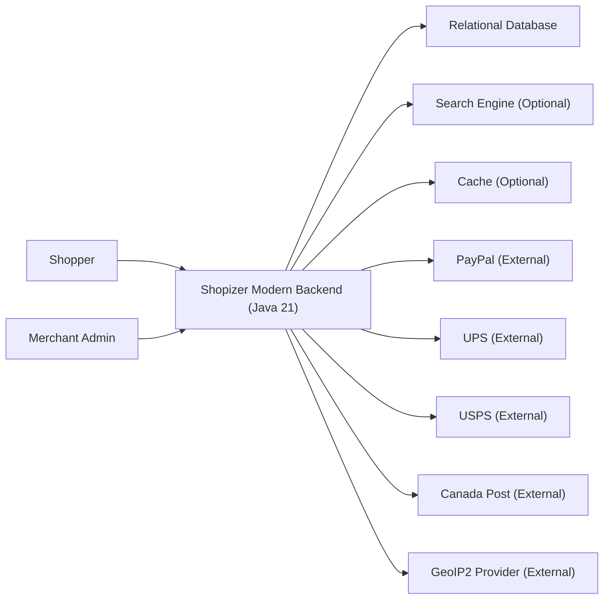
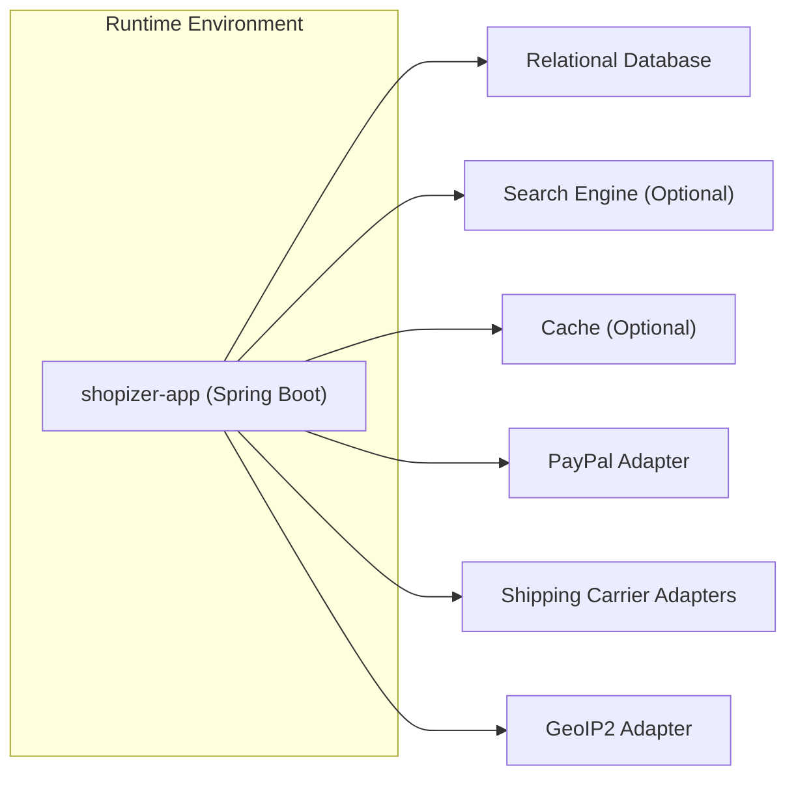

# Java 21 Shopizer Modernization Plan (Architecture Answers + Implementation Roadmap)

## 1. Purpose and Scope

This document records the recommended architecture decisions (“architecture answers”) and an implementation roadmap to deliver a full modernization of Shopizer to Java 21 within the `shopizer-modern-java21-329083` repository.

At the time of writing, the modern repository contains only a minimal README and placeholder folders. As a result, the plan below is necessarily a forward-looking specification and delivery plan rather than a description of existing implementation. Where Shopizer legacy behavior is referenced, it is based on the known legacy repository structure (for example, separate `sm-core` and `sm-shop` Maven modules) and commonly observed Shopizer patterns. The actual plan should be validated against the legacy repository code when implementation begins.

“Done” for this plan means it is actionable as a step-by-step roadmap, and it explicitly states which decisions are recommended vs. deferred.

## 2. Current Evidence and Gaps

The following evidence exists in the modern repository.

### 2.1 Evidence from the modern repo

The modern repository currently provides only a repository stub.

- `shopizer-modern-java21-329083/README.md` states the intent: “Shopizer java e-commerce software modernized to Java 21”.

There is no build file, no Spring Boot entrypoint, no source code, and no runtime configuration present in the modern repository yet.

### 2.2 Evidence from the legacy Shopizer repo (informational)

This modernization effort is described as “two-repository”: a classic Spring MVC implementation and a modernized Java 21 variant. The legacy repository is known to be composed of:

- A “core” module (commonly `sm-core`) that contains the domain model, services, integration modules (payments/shipping/cms), and data access.
- A web module (commonly `sm-shop`) that provides the storefront and admin UI (historically JSP/Tiles), and exposes MVC and REST endpoints.

This plan assumes the target modernization will retain the core e-commerce capabilities while changing deployment, runtime, and possibly UI integration patterns.

## 3. Recommended Architecture Answers (Decisions)

This section records recommended answers to the key architecture questions that typically drive a Java 21 modernization. If implementation constraints arise, these should be revisited and recorded as explicit decisions.

### 3.1 Build system and repository structure

The modernization should use Maven with a multi-module layout. This aligns with the legacy Shopizer approach and supports incremental migration by moving packages into the appropriate module without re-inventing the dependency graph.

Recommended target module layout is:

- `shopizer-app` as the Spring Boot executable (bootstraps HTTP, security, configuration, and exposes API endpoints).
- `shopizer-core` as the domain model, business services, and integration ports/adapters.
- Optional `shopizer-modules` for pluggable integrations (payment, shipping, CMS) if the legacy modules are numerous and benefit from isolation.

The modern repository should build a single executable artifact (a runnable JAR) and optionally a container image.

### 3.2 Spring framework and runtime

The modernization should use Spring Boot 3.x and Spring Framework 6.x, because that is the contemporary Spring baseline for Java 21 runtimes and is the most sustainable path for dependencies, observability, and security updates.

The application should run as:

- An embedded servlet container for API-first workloads (default embedded Tomcat), with external reverse proxy in production (for TLS termination, routing, static assets).
- A single-process deployment per instance, horizontally scalable behind a load balancer.

### 3.3 Architecture style and layering

The recommended architecture style is modular monolith with clear boundaries.

- The “core” should remain a single deployable unit for the modernization baseline.
- Clear module boundaries should be expressed in packages and build modules, not microservices, until there is evidence that microservice decomposition provides material benefit.

The internal layering should follow a port-and-adapter mindset:

- Domain and business services in `shopizer-core`.
- Persistence, external integrations, and HTTP controllers as adapters around the core.
- Shared cross-cutting utilities (serialization, validation, mapping, exceptions) kept minimal and in well-scoped packages.

### 3.4 Persistence approach

The modernization should adopt Spring Data JPA + Hibernate on a supported modern version compatible with Spring Boot 3.x. This provides a clear and widely-supported persistence foundation.

Database choice is not evidenced in the modern repo. The plan should support at least one primary relational database and allow configurable dialects via environment-specific properties.

Schema migration should be managed with Flyway (preferred) or Liquibase, and the tool choice should be recorded as a decision early because it impacts deployment and CI.

### 3.5 APIs and UI strategy

Because the modern repository does not yet contain storefront/admin UI assets, the safest modernization path is to treat the modern repo as an API-first backend and keep web UIs decoupled.

Recommended strategy:

- Expose REST APIs for storefront and admin capabilities.
- Maintain a thin MVC layer only if required to preserve legacy server-side rendering. If doing so, avoid JSP/Tiles as a long-term target; prefer a modern frontend strategy (for example, separate SPA) and keep the backend focused on APIs.

If the modernization must preserve legacy JSP/Tiles behavior, the plan still recommends isolating those concerns to the `shopizer-app` module and ensuring the core is UI-agnostic.

### 3.6 Security and authentication

The modernization should use Spring Security 6 and standardize on modern authentication and authorization patterns.

Recommended approach:

- API authentication via OAuth2 Resource Server (JWT) if integrating with external identity providers, or a first-party token approach if Shopizer remains self-contained.
- If the admin UI is server-side, session-based auth can be supported, but the backend should avoid mixing concerns and should document which endpoints are session-authenticated vs. token-authenticated.

Secrets (database password, API keys for payment/shipping providers) should be injected via environment variables or a secret manager; they must not be stored in repository files.

### 3.7 Integrations (payments, shipping, CMS, geo-IP)

Shopizer is known to integrate with several third parties (for example, PayPal, UPS/USPS/Canada Post, MaxMind GeoIP2). The modernization should encapsulate each integration as an adapter behind a stable interface in the core, so that upgrading libraries, endpoints, or credentials does not ripple through business logic.

Recommended standard:

- Define integration ports (interfaces) in `shopizer-core`.
- Implement adapters in integration modules/packages.
- Provide test doubles and contract/integration tests for each provider.

### 3.8 Search and indexing

Legacy Shopizer often uses an external search module (commonly Elasticsearch integration). The modernization should treat search as an optional subsystem:

- Provide a clear interface for indexing and querying.
- Allow “no search engine” mode (database-only) for local development.
- Add Elasticsearch/OpenSearch integration as an adapter.

### 3.9 Observability and operations

The modernization should include:

- Structured logging (JSON logs) suitable for centralized logging.
- Metrics via Micrometer and a Prometheus-compatible endpoint.
- Distributed tracing support (OpenTelemetry) if required by deployment environments.

Health and readiness endpoints should be enabled for container orchestration.

### 3.10 Deployment target

The initial deployment target should be containerized operation:

- Build a container image for the Spring Boot executable.
- Support configuration by environment variables.
- Provide a local development docker compose for dependencies (database, cache, search, etc.) as needed.

Kubernetes deployment artifacts are optional for the first milestone, but the application should be compatible with K8s assumptions (stateless service, externalized session if required, readiness/liveness endpoints).

## 4. High-Level Target Architecture Views (Mermaid)

These diagrams are forward-looking because the modern repository does not yet contain the implementation. They are intended as the target architecture baseline for the modernization.

### 4.1 System Context Diagram

This diagram shows the system boundary and major external actors/dependencies.

Read this diagram left-to-right. Human actors call the backend over HTTP. The backend persists state to the database, optionally uses search and caching, and integrates with external payment, shipping, and geo-location providers.

### 4.2 Container Diagram

This diagram shows the main runtime units and their relationships.

This architecture is intentionally a modular monolith: one deployable backend with internal modules, externalized state, and adapters for integrations.

## 5. Step-by-Step Implementation Plan (Roadmap)

This roadmap is structured in phases. Each phase has an objective, concrete tasks, and exit criteria. The phase boundaries are designed to reduce risk by ensuring the build, runtime, and a minimal vertical slice are working early.

### 5.1 Phase 0: Repository bootstrapping and baseline CI

The objective of this phase is to turn the modern repository from a placeholder into a buildable, runnable skeleton that can host the migration.

Tasks:
1. Create a multi-module Maven structure (parent POM + module POMs) targeting Java 21.
2. Add a Spring Boot application module with a minimal entrypoint class.
3. Add a health endpoint and an example controller to verify HTTP wiring.
4. Add basic formatting and static analysis tooling configuration (for example, Spotless/Checkstyle) if desired.
5. Add a minimal CI workflow that builds the project and runs unit tests.

Exit criteria:
- `mvn -q test` succeeds in CI.
- The application starts locally and serves a basic endpoint.
- The Java toolchain is pinned to Java 21.

### 5.2 Phase 1: Establish domain module boundary and core packaging

The objective of this phase is to create the “core” module boundary and confirm that core code is isolated from HTTP concerns.

Tasks:
1. Create `shopizer-core` module that contains domain model packages and business service interfaces.
2. Define the baseline package structure, for example:
   - `...core.catalog`
   - `...core.customer`
   - `...core.order`
   - `...core.payment`
   - `...core.shipping`
   - `...core.search`
   - `...core.content`
3. Define a small vertical slice in the core with explicit interfaces and DTOs (for example, “list products” and “get product details”).
4. Add unit tests for the core slice.

Exit criteria:
- `shopizer-core` compiles independently and has tests.
- No Spring MVC annotations appear in `shopizer-core`.
- The Spring Boot module depends on `shopizer-core`, not the reverse.

### 5.3 Phase 2: Persistence foundation and schema migration tool

The objective of this phase is to establish a stable database integration and a reproducible schema evolution approach.

Tasks:
1. Decide and adopt a migration tool (Flyway or Liquibase) and document the decision in this plan or an ADR.
2. Configure Spring Boot datasource properties using environment overrides.
3. Create initial schema migrations to support the minimal vertical slice (catalog tables and lookup/reference data).
4. Implement repositories (Spring Data JPA) and persistence adapters that satisfy core interfaces.
5. Add integration tests using a real database (for example, Testcontainers).

Exit criteria:
- The application can start with a clean database and apply migrations automatically.
- Integration tests verify persistence behavior for the vertical slice.
- Database access is encapsulated behind repository/adapter boundaries.

### 5.4 Phase 3: REST API baseline and error handling contract

The objective of this phase is to expose the initial vertical slice over HTTP using consistent API and error handling.

Tasks:
1. Define REST endpoints for the vertical slice (catalog read operations first).
2. Standardize on an error response format (for example, RFC 7807 problem details) and implement global exception handling.
3. Add request validation (Jakarta Bean Validation) and response DTO mapping.
4. Add API documentation generation (for example, OpenAPI) if desired.

Exit criteria:
- The API serves the catalog slice end-to-end (HTTP -> service -> DB -> response).
- Error responses are consistent and tested.
- OpenAPI spec is generated if included.

### 5.5 Phase 4: Authentication/authorization baseline (admin and shopper)

The objective of this phase is to establish a secure foundation before adding sensitive operations such as checkout and order management.

Tasks:
1. Decide on authentication modes for:
   - Shopper endpoints
   - Admin endpoints
2. Implement Spring Security configuration:
   - Token-based auth for APIs, or
   - Session auth if server-side admin UI is required.
3. Create role/permission model and enforce it at endpoints and service boundaries.
4. Add security tests for access control.

Exit criteria:
- Admin endpoints require authentication and correct authorization.
- Security configuration is documented and does not leak secrets.
- A minimal set of users/roles can be created and validated in tests.

### 5.6 Phase 5: Checkout and order processing vertical slice

The objective of this phase is to deliver the core commerce workflow: cart -> checkout -> order creation.

Tasks:
1. Implement shopping cart persistence and calculation services.
2. Implement checkout orchestration in the core with explicit transaction boundaries.
3. Implement order creation and order history persistence.
4. Define idempotency strategy for payment and order creation endpoints.

Exit criteria:
- End-to-end checkout creates an order and persists order totals and line items.
- Core business invariants are tested (for example, totals, taxes, currency rules).
- Failure scenarios are handled predictably (rollback, safe retries).

### 5.7 Phase 6: Payment integrations modernization

The objective of this phase is to modernize payment provider integrations behind stable interfaces.

Tasks:
1. Define payment provider port in `shopizer-core` (authorize/capture/refund patterns as needed).
2. Implement adapters for required providers (for example, PayPal).
3. Externalize provider configuration (API keys, endpoints).
4. Add integration tests or contract tests (with sandbox environments where possible).

Exit criteria:
- Payment can be initiated and its state is recorded consistently.
- Provider failures are mapped to user-safe errors and operational logs.
- No provider credentials are committed to the repository.

### 5.8 Phase 7: Shipping and tax integrations modernization

The objective of this phase is to deliver shipping quotes and tax calculations as part of checkout.

Tasks:
1. Define shipping quote and shipment purchase ports in the core.
2. Implement carrier adapters (UPS, USPS, Canada Post) as needed.
3. Implement tax rules model and configuration management.
4. Add tests for representative shipping/tax scenarios.

Exit criteria:
- Shipping quotes can be computed during checkout.
- Tax totals are stable and consistent across order recalculation.
- Integration error handling is robust (timeouts, invalid credentials, provider downtime).

### 5.9 Phase 8: Search indexing and product discovery

The objective of this phase is to implement search as an optional subsystem.

Tasks:
1. Define search ports (index, query) in the core.
2. Implement a “database-only” fallback search for minimal operation.
3. Implement external search adapter (Elasticsearch/OpenSearch) if required.
4. Add indexing jobs or event-driven indexing triggers.

Exit criteria:
- Search works in development without external dependencies.
- External search integration can be enabled via configuration.
- Indexing is observable and recoverable.

### 5.10 Phase 9: Content management and media handling

The objective of this phase is to modernize CMS-like capabilities (static pages, images, files).

Tasks:
1. Define content storage port (metadata + binary).
2. Decide on storage backend:
   - Database blob vs. filesystem vs. object storage adapter.
3. Implement upload/download endpoints with authorization controls.
4. Add virus scanning hooks if required by policy (optional, but plan for it).

Exit criteria:
- Content can be uploaded, stored, and served securely.
- Access control prevents unauthorized reads/writes.
- Large file handling and streaming behavior is tested.

### 5.11 Phase 10: Observability, performance, and hardening

The objective of this phase is to make the system production-ready.

Tasks:
1. Implement structured logging and correlation IDs.
2. Enable metrics and health probes.
3. Add load tests for key endpoints and baseline performance targets.
4. Review transaction boundaries and optimize hot paths.
5. Add rate limiting and abuse protections where appropriate.

Exit criteria:
- The application exposes metrics and health endpoints.
- Key flows are measurable and have baseline SLOs (even if tentative).
- Performance regressions can be detected in CI or staging.

### 5.12 Phase 11: Migration completeness and parity validation

The objective of this phase is to ensure feature parity with the legacy system where required.

Tasks:
1. Inventory legacy capabilities and decide “must-have” vs. “later”.
2. Build parity test suites where possible (API-level and business-level).
3. Validate data migration strategies if moving existing production data.

Exit criteria:
- A documented parity matrix exists.
- Must-have features are implemented and validated.
- Cutover plan exists (including rollback strategy).

## 6. Risk Register and Mitigations

This section lists known risks for a Java 21 modernization and how the plan mitigates them.

### 6.1 Dependency and API incompatibilities

Modern Spring Boot (3.x) uses Jakarta namespaces and requires dependency upgrades. The plan mitigates this by starting with a clean Spring Boot 3 baseline and migrating functionality in vertical slices, rather than bulk porting.

### 6.2 Hidden coupling between web and core

Legacy systems often embed web concepts into core services. The plan mitigates this by creating a clean `shopizer-core` boundary early and preventing reverse dependencies.

### 6.3 Integration instability and credential management

External providers frequently change endpoints, TLS requirements, and payload formats. The plan mitigates this by isolating providers behind ports and adding contract tests and robust configuration management.

### 6.4 Data migration complexity

If existing production data must move, schema differences and historical behavior can create migration risk. The plan mitigates this by establishing migrations early and treating data migration as a first-class deliverable with testable scripts.

## 7. Open Questions (To be Resolved During Implementation)

The modern repository currently lacks evidence for these items. They should be resolved and recorded as explicit decisions as soon as implementation begins.

1. Which database(s) must be supported for the modernization?
2. Is the storefront/admin UI in scope for the modern repo, or is the modern repo backend-only?
3. Which payment providers must be supported in the initial release?
4. Which shipping providers are required in the initial release?
5. Is an external identity provider required, or will Shopizer manage users internally?
6. Is Elasticsearch/OpenSearch required, or optional for the modernization baseline?
7. What is the deployment target (single VM, Docker Compose, Kubernetes) for the first production environment?

## 8. Sources

This plan is grounded in the following repository evidence.

- `shopizer-modern-java21-329083/README.md`
