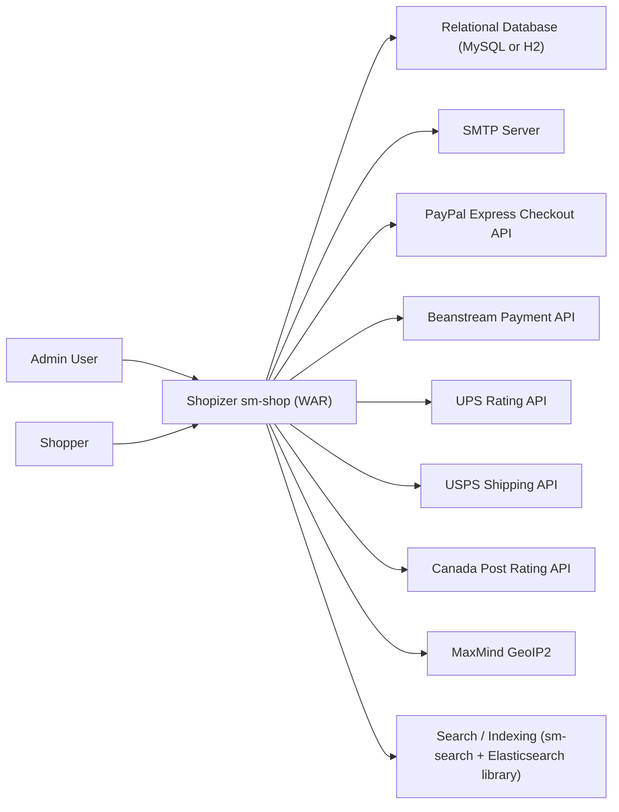
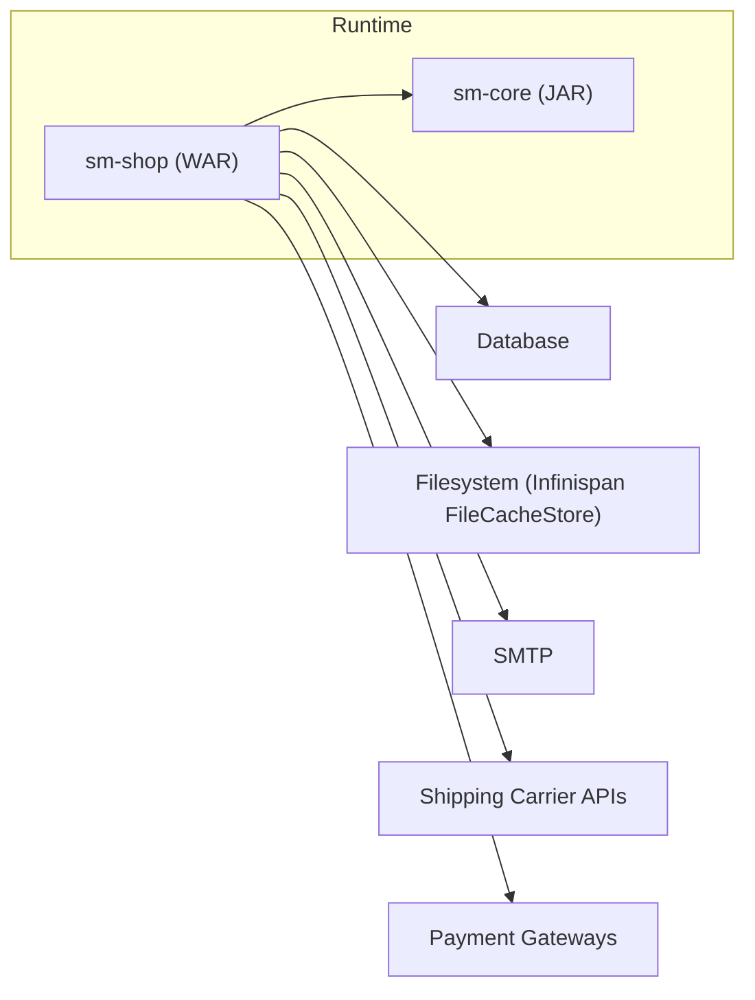
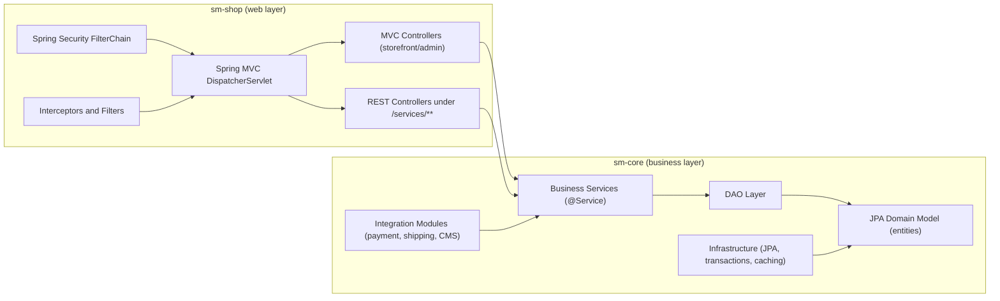
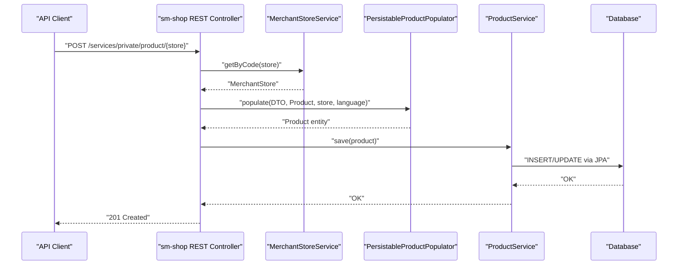
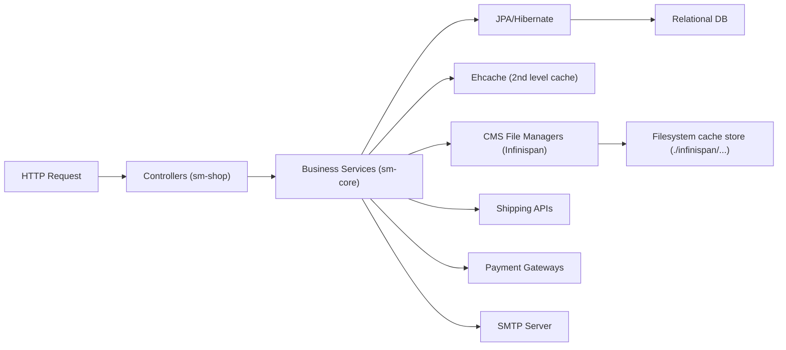
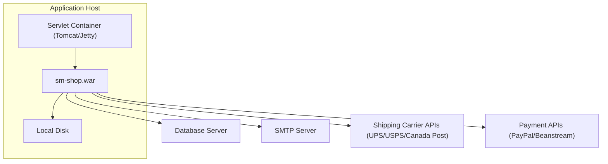

# Legacy Shopizer 2.x (Java 6) Architecture Overview

## Purpose and scope

This document describes the runtime architecture of the legacy Shopizer 2.x fork in `shopizer-329083/`, treated as a Java 6 era platform. It focuses on the system architecture map, runtime units, major internal components, representative request flows, data storage, and typical deployment topology.

This document intentionally does not enumerate every controller, entity, and database table. Its goal is to provide a reliable architectural map and to highlight key seams between layers and external dependencies.

## System context

At a high level, Shopizer 2.x is a monolithic web application deployed as a servlet WAR. The web module (`sm-shop`) contains the storefront and admin UI, plus REST-like endpoints under `/services/**`. The core business domain model and service layer live in `sm-core` and are used directly by the web layer.

External systems include a relational database (commonly MySQL or H2), payment gateways, shipping carrier APIs, and email infrastructure.

### Context diagram

The following diagram shows the system boundary and key external actors/services. It is a simplified view meant for orientation.

The “Search / Indexing” box reflects that `sm-core` depends on an `sm-search` module and Elasticsearch client libraries, but the concrete runtime topology for Elasticsearch is not fully specified by the sources used for this legacy overview.

## Runtime units (containers)

In this legacy fork, the primary runtime unit is the `sm-shop` WAR deployed to a servlet container. The WAR contains the Spring MVC dispatcher, Spring Security filter chain, controllers, and imports `sm-core` as a dependency for business services and persistence.

### Container diagram

The filesystem dependency is evidenced by Infinispan cache store locations configured under `./infinispan/...`, which are relative to the working directory of the servlet container process.

## Major internal components

The web container (`sm-shop`) is the HTTP boundary. It hosts UI controllers and REST controllers and relies on `sm-core` for business services. `sm-core` contains the domain model, DAO layer, service layer, module integrations, and persistence/caching configuration.

### Component diagram (simplified)

This decomposition matches the package layout implied by component scanning in the web MVC context and the explicit Spring context used by `sm-core`.

## Representative request flows

The legacy system uses a conventional Spring layering approach where controllers depend on services and services delegate to DAOs. The web layer also uses “Populator” classes to convert between web DTOs and internal domain entities.

### Example flow: create product via REST (happy path)

This sequence is based on the control flow described in the legacy documentation and evidenced by `ShopProductRESTController`, where a merchant store is resolved, a populator maps a DTO to a core entity, and the `ProductService` persists it.

## Data flow and storage

The platform persists its core business state (catalog, customers, orders, configurations, etc.) using JPA/Hibernate into a relational database. It also uses Hibernate second-level caching via Ehcache, and it uses Infinispan-based storage for CMS-like static content and product images, backed by filesystem cache stores.

The Infinispan filesystem locations are configured explicitly in the Infinispan XML configuration.

## Deployment / execution topology

The system is deployed as a WAR (`sm-shop`) to a servlet container (for example, Tomcat). The servlet container process must have network access to the database and outbound internet access to payment and shipping APIs, and it requires local filesystem access for Infinispan file cache stores.

Information about clustering, multiple nodes, load balancers, or containerization is not available from the sources used for this document.

## Interfaces and integration points (summary)

The application exposes three primary HTTP “areas” enforced by Spring Security: `/admin/**` for administrative UI, `/shop/**` for storefront, and `/services/**` for REST-like endpoints (with public/private subpaths). The inbound interface is servlet-based and configured via `web.xml`. UI rendering uses Tiles and JSP views, and some endpoints support JSON responses.

Outbound integrations include payment and shipping modules, geo-location utilities, search/indexing, and email sending.

## Sources

- `shopizer-modern-java21-329083/docs/documentation-conventions.md`: documentation placement conventions for the modern repo.
- `kavia-docs/CodeWiki/Architecture/shopizer-2x-legacy-architecture.md`: primary source for the legacy architecture narrative and diagrams.
- `kavia-docs/CodeWiki/Architecture/shopizer-2x-legacy-modules.md`: supporting source for module boundaries and coupling.
- `kavia-docs/CodeWiki/Architecture/shopizer-2x-legacy-service-layer.md`: supporting source for request flow and service layer patterns.
- `kavia-docs/CodeWiki/Architecture/shopizer-2x-legacy-data-model.md`: supporting source for data storage and persistence overview.
- `kavia-docs/CodeWiki/Architecture/shopizer-2x-legacy-external-integrations.md`: supporting source for external system inventory.
