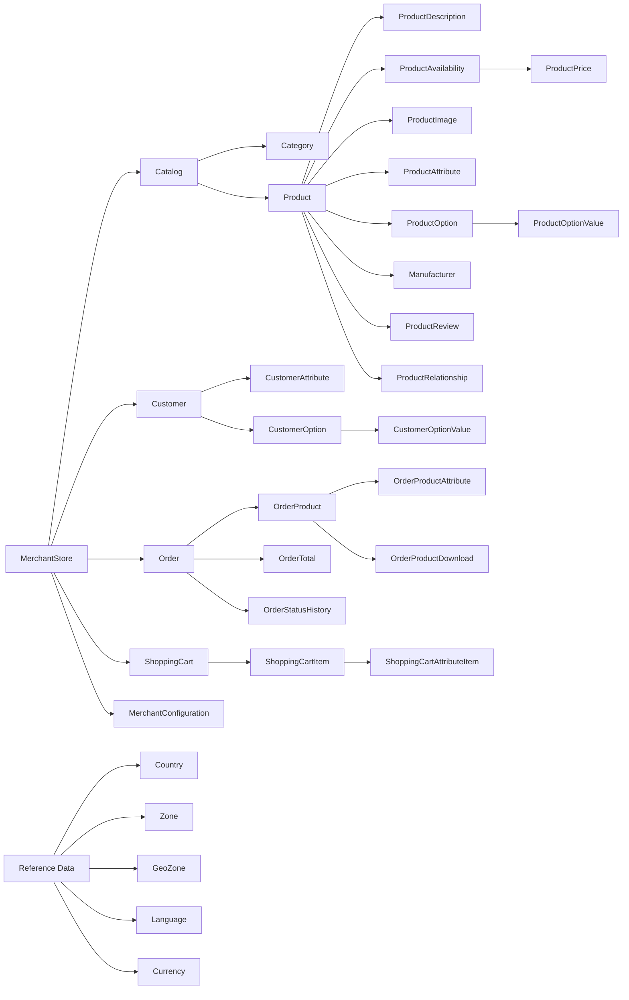

# Legacy Shopizer 2.x (Java 6) Entity and Data Model

## Purpose and scope

This document describes the legacy Shopizer 2.x domain data model at an architectural level. It is grounded in the explicit JPA persistence unit configuration in `sm-core` and highlights the primary aggregates and conceptual relationships.

This is not a full ERD. The legacy repository includes many JPA entities with rich relationships. For exact mappings, refer to the annotated entity classes that are included in the persistence unit.

## Persistence technology and persistence unit

The core domain model is persisted using JPA 2.0 with Hibernate as the provider. The platform’s persistence unit is named `sm-unit` and explicitly enumerates entity classes in `sm-core/src/main/resources/META-INF/sm-persistence.xml`.

Spring configuration uses a `LocalContainerEntityManagerFactoryBean` tied to this persistence unit, with additional Hibernate properties (dialect, schema, `hbm2ddl` policy) supplied via property placeholder configuration.

## Major domain areas (aggregates)

The persistence unit enumerates entities that fall into these primary areas.

### Merchant and system configuration

The merchant/store concept is central. `MerchantStore` represents the store tenant, and various configuration entities are scoped to merchant and/or system, including:

- `MerchantStore`
- `SystemConfiguration`
- `IntegrationModule`
- `MerchantConfiguration`
- `SystemNotification`
- `MerchantLog`

These entities support per-store configuration such as enabled integrations, store settings, and notifications/logging.

### Reference data (i18n and geography)

Reference data supports multi-country, multi-language, and multi-currency storefront behavior, including:

- `Country` and `CountryDescription`
- `Zone` and `ZoneDescription`
- `GeoZone` and `GeoZoneDescription`
- `Language`
- `Currency`

### Catalog

The catalog includes categories, products, and their sub-entities, including:

- `Category` and `CategoryDescription`
- `Product` and `ProductDescription`
- `ProductAttribute`
- `ProductOption`, `ProductOptionDescription`
- `ProductOptionValue`, `ProductOptionValueDescription`
- `ProductAvailability`
- `ProductPrice` and `ProductPriceDescription`
- `ProductImage` and `ProductImageDescription`
- `DigitalProduct`
- `Manufacturer` and `ManufacturerDescription`
- `ProductRelationship`
- `ProductReview` and `ProductReviewDescription`
- `ProductType`

In the legacy implementation, products are treated as an aggregate with associated availabilities, prices, attributes, relationships, and images. Service-layer lifecycle operations commonly create/update/delete sub-entities along with the main `Product`.

### Customers

Customer persistence includes:

- `Customer`
- `CustomerAttribute`
- `CustomerOption`
- `CustomerOptionDescription`
- `CustomerOptionValue`
- `CustomerOptionValueDescription`
- `CustomerOptionSet`

This indicates a flexible attribute model where customers can have configurable options and option values, with descriptions supporting i18n.

### Orders

Orders represent checkout and purchase history, including:

- `Order`
- `OrderTotal`
- `OrderProduct`
- `OrderProductAttribute`
- `OrderProductDownload`
- `OrderProductPrice`
- `OrderStatus`
- `OrderStatusHistory`
- `FileHistory`

This implies order lines, line attributes, downloadable products, and a status history trail.

### Shopping cart

Shopping cart state (pre-order) is persisted as:

- `ShoppingCart`
- `ShoppingCartItem`
- `ShoppingCartAttributeItem`

### Taxes

Tax configuration is represented by:

- `TaxClass`
- `TaxRate`
- `TaxRateDescription`

Taxes can then be applied by tax class association and store/country rules.

## Conceptual relationship map

The diagram below is an architectural-level map of the main aggregates and typical relationships. It is intentionally simplified and should be read as “contains or references,” not as a strict foreign-key map.

## Storage and caching considerations

The legacy system enables Hibernate second-level caching via Ehcache (as indicated by core configuration referenced in legacy documentation). Separately from the JPA relational model, the platform uses Infinispan for certain CMS/static content storage, backed by filesystem cache stores.

## Sources

- `shopizer-modern-java21-329083/docs/documentation-conventions.md`: documentation placement conventions for the modern repo.
- `kavia-docs/CodeWiki/Architecture/shopizer-2x-legacy-data-model.md`: primary source for the legacy data model narrative and diagram.
- `kavia-docs/CodeWiki/Architecture/shopizer-2x-legacy-service-layer.md`: supporting source for aggregate lifecycle behavior (product/cart examples).
