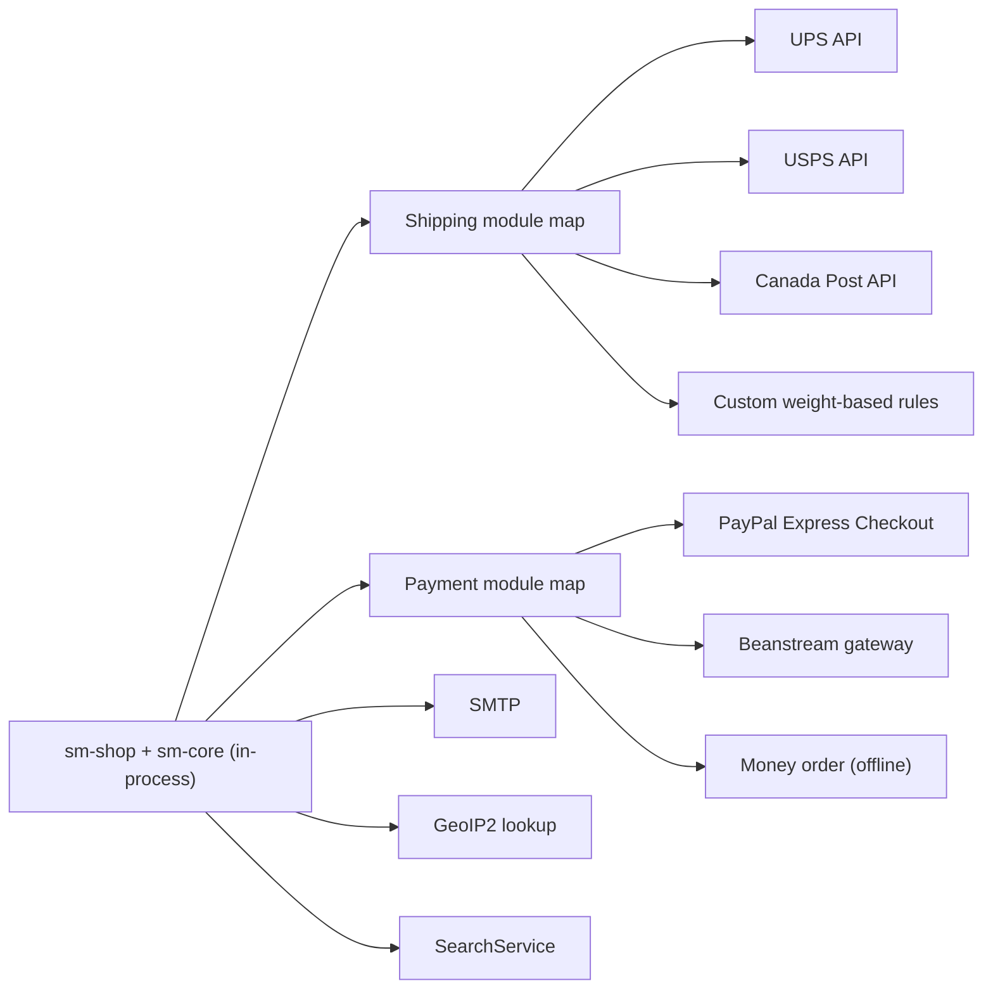

# Legacy Shopizer 2.x (Java 6) External Integrations

## Purpose and scope

This document describes the external integrations that are explicitly evidenced in the legacy Shopizer 2.x fork under `shopizer-329083/`. It focuses on payment gateways, shipping carriers, email delivery, geo-location, and search/indexing. These are the integration points most likely to impact modernization work.

This document is built primarily from the legacy module wiring and integration registry sources described below.

## Integration architecture pattern

Shopizer 2.x uses a “pluggable modules by code” pattern.

Each integration is represented by:

A module code string such as `ups` or `paypal-express-checkout`.

A concrete Spring bean implementing a typed integration interface (for example a shipping quote module interface or a payment module interface).

A Spring `util:map` that registers modules by code and bean reference, enabling runtime selection by module code.

In practice, application logic selects a module implementation by code and invokes it through a common interface. Per-module endpoint configuration is represented in resource metadata and is often persisted as merchant configuration.

## Shipping carrier integrations

### UPS

The UPS module code is `ups`. The integration registry includes:

Test endpoint: `https://wwwcie.ups.com:443/ups.app/xml/Rate`

Production endpoint: `https://onlinetools.ups.com:443/xml/Rate`

The Spring bean registered for `ups` is `com.salesmanager.core.modules.integration.shipping.impl.UPSShippingQuote`. The registry also includes a “details” map of service codes to human-friendly shipping method names.

### USPS

The USPS module code is `usps`. The registry includes:

Test endpoint: `http://testing.shippingapis.com:80/ShippingAPI.dll`

Production endpoint: `http://production.shippingapis.com:80/ShippingAPI.dll`

The Spring bean registered for `usps` is `com.salesmanager.core.modules.integration.shipping.impl.USPSShippingQuote`.

### Canada Post

A `canadapost` module is registered as `com.salesmanager.core.modules.integration.shipping.impl.CanadaPostShippingQuote`.

The integration registry excerpt used by the legacy documentation did not provide Canada Post endpoint details. If endpoint configuration exists, it was not evidenced in the sources used for this port.

### Custom weight-based shipping

A `weightBased` module is registered as a custom module (`customModule` set to true) with region `*`. The Spring bean is `com.salesmanager.core.modules.integration.shipping.impl.CustomWeightBasedShippingQuote`.

This module is described as computing shipping based on merchant-configured weight and price rules rather than calling external carrier APIs.

## Payment integrations

### PayPal Express Checkout

The payment module code is `paypal-express-checkout`. The integration registry specifies redirect URLs used for express checkout:

Test config: `https://www.sandbox.paypal.com/cgi-bin/webscr?cmd=_express-checkout&token=`

Production config: `https://www.paypal.com/cgi-bin/webscr?cmd=_express-checkout&token=`

The Spring bean registered is `com.salesmanager.core.modules.integration.payment.impl.PayPalExpressCheckoutPayment` (bean id `paypal-ec`).

The legacy documentation also notes that the web module has PayPal express checkout URLs configured as properties in `sm-shop/src/main/webapp/WEB-INF/spring/appServlet/shopizer-properties.xml`, suggesting the web layer participates in redirect/checkout flows in addition to core module operations.

### Beanstream

The payment module code is `beanstream`. The integration registry specifies:

Test endpoint: `https://www.beanstream.com:443/scripts/process_transaction.asp`

Production endpoint: `https://www.beanstream.com:443/scripts/process_transaction.asp`

The Spring bean registered is `com.salesmanager.core.modules.integration.payment.impl.BeanStreamPayment`.

### Money order

A `moneyorder` payment module is present with type `moneyorder` and region `*`. The Spring bean is `com.salesmanager.core.modules.integration.payment.impl.MoneyOrderPayment`.

This is typically an offline payment type and may not involve external network calls, but its exact runtime behavior should be confirmed in the module implementation.

## Email delivery (SMTP)

Email sending uses Spring’s `JavaMailSenderImpl`, configured via properties including:

`mailSender.protocol`, `mailSender.host`, `mailSender.port`

`mailSender.username`, `mailSender.password`

`mail.smtp.auth`, `mail.smtp.starttls.enable`

Email templates use FreeMarker with template loader path `/templates/email`. A sender component `HtmlEmailSenderImpl` is registered to send templated HTML emails.

## Geo-location (MaxMind GeoIP2)

A `geoLocation` bean is registered as `com.salesmanager.core.modules.utils.GeoLocationImpl`. The legacy module documentation notes that `sm-core/pom.xml` includes `com.maxmind.geoip2:geoip2:0.7.0`.

The specific database file (GeoLite2/GeoIP2 mmdb) location and configuration are not evidenced by the sources used for this port.

## Search and indexing

The legacy `sm-core` module depends on an `sm-search` module and includes an Elasticsearch dependency version property (`0.90.2`). The product lifecycle service (`ProductServiceImpl`) invokes `SearchService.index(...)` and `SearchService.deleteIndex(...)`, indicating indexing side effects on product create/update/delete.

The runtime topology and configuration for the search backend (for example cluster address, index names, credentials) are not evidenced by the sources used for this port.

## Integration map diagram

## Sources

- `shopizer-modern-java21-329083/docs/documentation-conventions.md`: documentation placement conventions for the modern repo.
- `kavia-docs/CodeWiki/Architecture/shopizer-2x-legacy-external-integrations.md`: primary source for integration list and endpoints.
- `kavia-docs/CodeWiki/Architecture/shopizer-2x-legacy-architecture.md`: supporting source for system context and integration boundaries.
