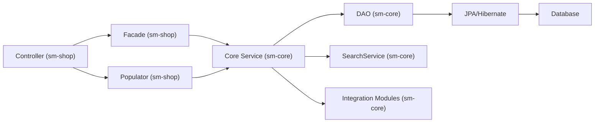

# Legacy Shopizer 2.x (Java 6) Service and Controller Reference

## Purpose and scope

This document provides a reference-style overview of how the legacy Shopizer 2.x codebase structures controllers and services, and it lists the key package locations that readers typically need when navigating the legacy implementation.

This is not a complete API catalog of every endpoint and method. The legacy repository is large and heavily XML-configured; a complete catalog would require an automated extraction step. Instead, this document focuses on the patterns, key packages, and a few strongly-evidenced concrete examples that are commonly used to understand request flow.

## Controller layer (sm-shop)

### Controller package map

In the legacy fork, the HTTP boundary lives in `sm-shop` and is implemented using Spring MVC (servlet-based). Controllers are divided into:

`com.salesmanager.web.shop.controller`: storefront MVC controllers. This package includes shopping cart-related controllers and facades under subpackages such as `shoppingCart`.

`com.salesmanager.web.admin.controller`: admin MVC controllers, typically used for managing catalog, customers, orders, shipping, payment, and configuration via server-rendered views (JSP/Tiles).

`com.salesmanager.web.services.controller`: REST-like controllers under `/services/**`. These controllers commonly use web DTOs and “populator” classes to map to/from `sm-core` entities.

### Web-layer orchestration services (“facades”)

The web module contains “facade” services annotated with `@Service` (in the web module), which orchestrate multiple `sm-core` services and apply web-specific business rules and DTO conversions.

A representative example is `ShoppingCartFacadeImpl`, which coordinates `ShoppingCartService`, `ProductService`, and `ShoppingCartCalculationService`, and populates a web-facing `ShoppingCartData` model.

### Web DTO/entity mapping (“populators”)

A common pattern in REST endpoints is to accept a web DTO (for example a “Persistable” model) and convert it to a core entity using a populator. This supports JSON payload stability without exposing JPA entities directly, but the mapping is still in-process and tightly coupled to internal service behaviors.

A representative example is `PersistableProductPopulator`, used by `ShopProductRESTController`.

## Service layer (sm-core)

### Service package map

The service layer primarily lives in `sm-core` under `com.salesmanager.core.business.<domain>.service`. A typical structure includes:

- A domain service interface (for example `ProductService`) used as the public API surface.
- A Spring-managed implementation annotated with `@Service` (for example `ProductServiceImpl`).
- One or more DAO dependencies injected into the service implementation.
- Additional service dependencies injected to manage side effects such as search indexing and file/image handling.

Because `sm-shop` component scans `com.salesmanager.core.business`, these services are frequently autowired directly into controllers and/or facades.

### DAO package map

DAOs are typically organized under `com.salesmanager.core.business.<area>.dao` and are invoked by services for persistence queries and bulk operations.

### Transaction management and boundaries

Transaction management is configured in `sm-core/src/main/resources/spring/spring-context.xml`. The configuration enables `tx:annotation-driven` and defines a `JpaTransactionManager` tied to the JPA `entityManagerFactory`.

In addition, the legacy configuration defines an AOP advisor that applies transaction advice to beans matching a pointcut targeting:

`this(com.salesmanager.core.business.generic.service.TransactionalAspectAwareService)`

The advice marks `get*`, `list*`, and `search*` methods as read-only and applies rollback semantics for `com.salesmanager.core.business.generic.exception.ServiceException` for other methods. In practice, this means transactions are usually demarcated at the service call boundary within the monolith.

## Concrete, evidenced examples

### Product lifecycle services

`ProductService` is a core service interface used as a stable boundary for product operations. The legacy documentation indicates it supports listing by store/criteria, retrieval by SEO URL and SKU, and operations involving product descriptions/locales.

`ProductServiceImpl` demonstrates that core services frequently orchestrate multiple sub-entity lifecycles and side effects. Behaviors described in the legacy documentation include:

Product description updates trigger search indexing.

Product deletion triggers cleanup of associated images and relationships and deletes the search index entry.

Save/update operations manage availabilities, prices, attributes, relationships, and images, including cleanup of orphaned rows.

The presence of `SearchService` usage indicates indexing is coupled to product lifecycle operations.

### Shopping cart orchestration (web facade)

`ShoppingCartFacadeImpl.addItemsToShoppingCart` is described as coordinating:

Fetching or creating cart state via `ShoppingCartService`.

Validating products via `ProductService`.

Applying business rules for duplicate merging when line items have no attributes.

Persisting updates and recalculating totals via `ShoppingCartCalculationService`.

Populating web-facing DTOs via a `ShoppingCartDataPopulator`.

This style of “facade orchestration + populator mapping” is one of the most important patterns to understand when migrating HTTP-level flows.

## Layering summary diagram

The following diagram summarizes the typical call chain for a feature from HTTP into persistence and integrations.

## Sources

- `shopizer-modern-java21-329083/docs/documentation-conventions.md`: documentation placement conventions for the modern repo.
- `kavia-docs/CodeWiki/Architecture/shopizer-2x-legacy-service-layer.md`: primary source for service layer structure, transaction patterns, and examples.
- `kavia-docs/CodeWiki/Architecture/shopizer-2x-legacy-modules.md`: supporting source for controller/facade/populator package placement.
- `kavia-docs/CodeWiki/Architecture/shopizer-2x-legacy-architecture.md`: supporting source for the end-to-end request flow framing.
