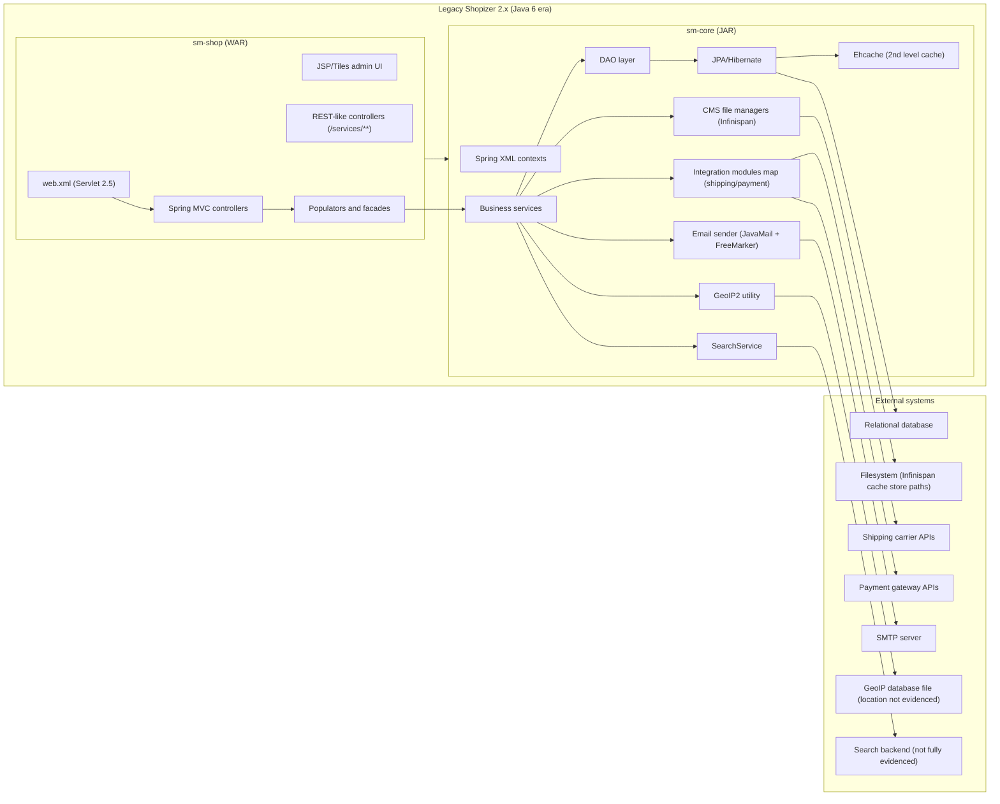

# Shopizer 2.x to Java 21 Migration Analysis (Legacy-to-Modern)

## Purpose and scope

This document analyzes the legacy Shopizer 2.x codebase (the Java 6 era fork located at `shopizer-329083/`) to support migration into the modern Java 21 repository (`shopizer-modern-java21-329083/`). It consolidates the legacy documentation set under `docs/legacy-shopizer-2x/` into migration-oriented artifacts.

This document covers a module criticality matrix, an evidence-based dead-code and unused-feature list, and a dependency graph with Java-6-specific constraints. The proposed Java 21 target architecture is documented separately in `docs/target-architecture.md`.

## Primary sources used

The analysis in this document is grounded in the legacy documentation set maintained in the modern repository, plus concrete legacy configuration files and a small number of representative implementation files.

The legacy documentation sources are:

- `shopizer-modern-java21-329083/docs/legacy-shopizer-2x/architecture-overview.md`
- `shopizer-modern-java21-329083/docs/legacy-shopizer-2x/module-and-package-map.md`
- `shopizer-modern-java21-329083/docs/legacy-shopizer-2x/entity-data-model.md`
- `shopizer-modern-java21-329083/docs/legacy-shopizer-2x/service-and-controller-reference.md`
- `shopizer-modern-java21-329083/docs/legacy-shopizer-2x/external-integrations.md`

The primary legacy code/config evidence used is:

- `shopizer-329083/sm-shop/src/main/webapp/WEB-INF/web.xml`
- `shopizer-329083/sm-core/src/main/resources/spring/spring-context.xml`
- `shopizer-329083/sm-core/src/main/resources/spring/shopizer-core-modules.xml`
- `shopizer-329083/sm-core/src/main/resources/reference/integrationmodules.json`
- `shopizer-329083/sm-core/src/main/resources/META-INF/sm-persistence.xml`
- `shopizer-329083/sm-core/src/main/java/com/salesmanager/core/business/search/service/SearchServiceImpl.java` (representative search implementation)
- `shopizer-329083/sm-shop/src/main/java/com/salesmanager/web/shop/controller/search/SearchController.java` (representative search controller)
- `shopizer-329083/sm-core/src/main/java/com/salesmanager/core/modules/integration/payment/impl/PayPalRestPayment.java` (evidence of dead/placeholder integration code)

## Legacy baseline summary (what exists today)

Shopizer 2.x in this workspace is a monolithic, servlet WAR deployment. The `sm-shop` module is the web application and imports `sm-core` in-process. The web layer exposes storefront and admin MVC controllers and “REST-like” endpoints under `/services/**`. The domain model, DAOs, service layer, and integration modules live in `sm-core`.

This is evidenced by:

- `sm-shop` loading Spring contexts and a `DispatcherServlet` via `WEB-INF/web.xml` (classic Spring MVC setup).
- `sm-core` defining component scanning, JPA/Hibernate configuration, transactional AOP, and integration module wiring via XML (`spring-context.xml`, `shopizer-core-modules.xml`).

## Module criticality matrix

The table below classifies legacy modules/components by criticality for a functioning commerce platform, change risk, and migration strategy. The goal is to make sequencing explicit: migrate high-criticality, high-fan-in capabilities early behind stable interfaces.

The “evidence” column is intentionally concrete: it points to the legacy analysis documents and/or configuration artifacts that demonstrate the module exists and is wired into the runtime.

### Criticality legend

Criticality describes whether the platform can serve core commerce flows without the module.

- Critical: required for core store operation (browse, cart, checkout, orders, admin operations).
- Important: not required for basic operation but expected in production deployments or common flows.
- Optional: can be deferred without blocking a minimal viable store.

### Matrix

| Module / capability area | Where it lives in legacy | Criticality | Change risk in migration | Migration approach | Evidence |
|---|---|---:|---:|---|---|
| Web app / HTTP boundary (storefront + admin + `/services/**`) | `sm-shop` | Critical | High | Rebuild as Spring Boot 3.x web API + optional UI, keep URL compatibility only if required | `sm-shop/src/main/webapp/WEB-INF/web.xml`, `docs/legacy-shopizer-2x/architecture-overview.md` |
| Core domain model (JPA entities) | `sm-core` | Critical | High | Extract domain into bounded contexts; move to Flyway-managed schema and modern JPA mappings | `sm-core/src/main/resources/META-INF/sm-persistence.xml`, `docs/legacy-shopizer-2x/entity-data-model.md` |
| Service layer (business operations + transactions) | `sm-core` | Critical | High | Define explicit service APIs; split orchestration from persistence; replace XML-driven tx with Spring Boot conventions | `sm-core/src/main/resources/spring/spring-context.xml`, `docs/legacy-shopizer-2x/service-and-controller-reference.md` |
| Catalog (category/product/availability/price/images/reviews) | `sm-core` + web DTO/populators | Critical | High | Carve out “catalog” service boundary early; stabilize read-model endpoints first | `sm-persistence.xml` (catalog entity list), `docs/legacy-shopizer-2x/entity-data-model.md` |
| Shopping cart | `sm-core` + web facades | Critical | High | Model cart as its own service boundary; keep cart lifecycle and pricing rules cohesive | `sm-persistence.xml` (ShoppingCart entities), `docs/legacy-shopizer-2x/service-and-controller-reference.md` |
| Orders (checkout, order totals, status history, downloads) | `sm-core` + web flows | Critical | High | Extract order workflow; define idempotent checkout and payment intents | `sm-persistence.xml` (Order entities), `docs/legacy-shopizer-2x/entity-data-model.md` |
| Payments integration modules | `sm-core` modules | Important | High | Replace with modern payment adapters; keep “payment module by code” concept but implement via Spring Boot starters/adapters | `shopizer-core-modules.xml`, `integrationmodules.json`, `docs/legacy-shopizer-2x/external-integrations.md` |
| Shipping integration modules | `sm-core` modules | Important | Medium | Extract into shipping-rating adapter service; preserve module codes and configuration semantics | `shopizer-core-modules.xml`, `integrationmodules.json` |
| Search / indexing (Elasticsearch-era integration) | `sm-core` + `sm-shop` controllers | Important | High | Replace client + mapping; avoid porting ES 0.90 assumptions; add a dedicated search service or external managed search | `spring-context.xml` imports `shopizer-search.xml`, `SearchServiceImpl.java`, `SearchController.java`, `docs/legacy-shopizer-2x/external-integrations.md` |
| CMS/static content storage (Infinispan file cache store) | `sm-core` modules | Important | Medium | Replace with object storage (S3-compatible) or Postgres large objects; keep public URLs stable | `shopizer-core-modules.xml` (CMS beans), `docs/legacy-shopizer-2x/module-and-package-map.md` |
| Email templates + SMTP delivery | `sm-core` modules | Important | Medium | Keep templating but modernize mail config and secrets; consider async delivery | `shopizer-core-modules.xml` (mailSender, freemarker config) |
| Geo-location (GeoIP2) | `sm-core` modules | Optional | Low | Keep behind an interface; can be deferred or replaced with external provider | `shopizer-core-modules.xml` (geoLocation bean), `docs/legacy-shopizer-2x/external-integrations.md` |
| Admin UI technology (JSP/Tiles/SmartClient assets) | `sm-shop` webapp | Optional | High | Replace with separate SPA or reuse admin APIs only; do not port JSP/Tiles | `docs/legacy-shopizer-2x/module-and-package-map.md`, presence of `sm-shop/src/main/webapp` |
| Legacy scheduler / Quartz (UI assets indicate Quartz modules) | `sm-shop` static assets | Optional | Unknown | Only migrate if jobs are evidenced in server-side code/config; otherwise treat as unused UI library | `sm-shop/src/main/webapp/resources/smart-client/system/modules/ISC_Scheduler.js` (UI module only) |

## Dead code and unused feature inventory (evidence-based)

This section lists items that appear to be unused, deprecated, or “dead” in the legacy repository based on concrete evidence available in this workspace. This is not a full dead-code elimination report because we are not running static analysis tools here; instead, it is a migration-focused inventory of “do not port blindly” candidates.

### Items that are strongly evidenced as dead or placeholder

#### PayPal REST payment implementation appears incomplete / placeholder

The legacy code includes a `PayPalRestPayment` integration implementation where many behaviors are commented out or left as placeholders. This is a strong signal that it should not be treated as a supported integration during migration.

- Evidence: `shopizer-329083/sm-core/src/main/java/com/salesmanager/core/modules/integration/payment/impl/PayPalRestPayment.java`

Migration implication: treat PayPal Express Checkout (`paypal-express-checkout`) as the only evidenced PayPal integration from the module registry, and do not port the REST payment class as-is.

### Items that are likely unused or “not migration-worthy” (needs confirmation)

The items below are candidates for exclusion from the “first-pass” migration because they are either legacy UI libraries or ancillary capabilities. These should be validated against product requirements and runtime usage before removal.

#### SmartClient module library in `sm-shop` web resources

The repository contains a large SmartClient JavaScript library under `sm-shop/src/main/webapp/resources/smart-client/system/modules/`. This is a heavy client-side framework and may not align with the modern target architecture.

- Evidence: directory tree under `sm-shop/src/main/webapp/resources/smart-client/system/modules/` (for example `ISC_Scheduler.js`, `ISC_SQLBrowser.js`).

Migration implication: do not port these assets unless there is clear evidence the admin UI depends on them at runtime. If the modern target uses a separate frontend, these become unused.

#### Legacy Bootstrap 2.x and Font Awesome 3.x assets

The storefront/admin resources include Bootstrap 2.0.4-era assets and Font Awesome 3.2.1. These are legacy frontend dependencies and do not inform the backend migration except for UI parity concerns.

- Evidence: `sm-shop/src/main/webapp/resources/templates/bootstrap/js/bootstrap-*.js`, `sm-shop/src/main/webapp/resources/css/font-awesome/*`.

Migration implication: if UI is reimplemented, these are not migrated.

#### CKEditor vendor bundle under `sm-shop` web resources

The repository contains a full CKEditor distribution (plugins, skins, languages). This is again a UI-layer dependency that can be decoupled from backend modernization.

- Evidence: `sm-shop/src/main/webapp/resources/js/ckeditor/**`.

Migration implication: treat as frontend-only and migrate only if the modern admin UI needs in-browser rich text editing.

### Items that are “unknown from available sources”

Some features are mentioned in high-level descriptions (for example, runtime topology for Elasticsearch, job scheduling, clustering). When the supporting configuration/entrypoints are not present in the sources we used, this document does not classify them as dead code, but flags them as “unknown” to avoid assumptions.

Examples:

- Elasticsearch runtime topology and version pinning are mentioned in legacy docs, but the operational config and infrastructure are not fully evidenced in the analyzed sources.
- A scheduler UI module exists in SmartClient assets, but server-side Quartz jobs are not evidenced from the sources used here.

## Legacy dependency graph and Java-6-specific constraints

### What the dependency graph needs to communicate

For migration planning, the key dependencies are:

- `sm-shop` depends on `sm-core` in-process and also component-scans `sm-core` packages, creating strong coupling.
- `sm-core` encapsulates persistence (JPA/Hibernate), caching (Ehcache), and integration module wiring (shipping/payment/CMS/email/geo).
- `sm-core` imports “search” wiring (`shopizer-search.xml`), and application services call into a `SearchService` implementation.

### Dependency graph (with Java 6 era constraints)

The diagram below highlights the main runtime and build-time relationships. It also explicitly calls out Java-6-era framework constraints that affect migration sequencing.

### Java-6-specific constraints (evidenced and implied)

#### Servlet 2.5 and classic `web.xml` bootstrapping

The legacy app declares `web-app` version `2.5` and uses `web.xml` to bootstrap Spring’s `ContextLoaderListener`, `DispatcherServlet`, and `DelegatingFilterProxy`. This implies the runtime model is a traditional external servlet container deployment rather than a self-contained Spring Boot process.

- Evidence: `shopizer-329083/sm-shop/src/main/webapp/WEB-INF/web.xml`.

Migration implication: moving to Spring Boot 3.x will require replacing this entire bootstrapping model with `@SpringBootApplication`, Spring Security configuration classes, and embedded servlet container defaults.

#### Spring 3.1-era XML configuration patterns

The legacy core uses Spring XML namespaces pinned to `spring-*-3.1.xsd` and relies heavily on XML imports for datasource, cache, properties, modules, and search wiring. It also configures transactions using `tx:annotation-driven` plus an AOP advisor over a pointcut.

- Evidence: `shopizer-329083/sm-core/src/main/resources/spring/spring-context.xml`.

Migration implication: Spring Boot 3.x (Spring Framework 6) removes or changes compatibility for many older patterns; porting should translate these to Java config and Boot auto-configuration patterns rather than copying XML.

#### Integration module registry keyed by strings (stable migration seam)

Shipping and payment modules are registered in `util:map` structures keyed by module code strings (for example `ups`, `usps`, `paypal-express-checkout`). Endpoint metadata also exists in `integrationmodules.json`.

- Evidence: `shopizer-329083/sm-core/src/main/resources/spring/shopizer-core-modules.xml`, `shopizer-329083/sm-core/src/main/resources/reference/integrationmodules.json`.

Migration implication: this “module code -> implementation” registry is a useful seam. You can keep module codes as externalized configuration identifiers while implementing adapters as Spring Boot beans and/or separate microservices.

#### Search coupling into product lifecycle

The legacy documentation states that product updates and deletes trigger search indexing operations. This is consistent with the presence of `SearchServiceImpl` and search controllers.

- Evidence: `shopizer-329083/sm-core/src/main/java/com/salesmanager/core/business/search/service/SearchServiceImpl.java`, `shopizer-329083/sm-shop/src/main/java/com/salesmanager/web/shop/controller/search/SearchController.java`, and `docs/legacy-shopizer-2x/service-and-controller-reference.md`.

Migration implication: do not treat search as “just a query feature.” It is part of write-side consistency, and the target architecture should make indexing explicit (for example, outbox events, async indexing).

## Migration sequencing recommendations (high-level)

A practical migration sequence, based on the criticality matrix and the coupling observed in the legacy system, is:

First, establish the new platform foundation: Java 21, Spring Boot 3.x conventions, PostgreSQL 16, Flyway, and a basic authentication/authorization approach that can later be extended for admin vs storefront concerns. The legacy system’s security model is configured via XML (not included in the evidence set read here), so a modern replacement should be treated as a design decision rather than a direct port.

Second, migrate the core domain and read APIs for catalog, because they have high fan-in across storefront, admin, cart, and order flows.

Third, migrate cart and order flows with payment and shipping behind adapter interfaces. Treat search indexing as asynchronous side effects to avoid tight coupling at first.

Finally, decide on UI strategy (replace legacy JSP/Tiles, introduce SPA, or expose APIs only), and migrate optional capabilities such as geo features and legacy static asset handling.

Task completed in this document: module criticality matrix, dead/unused inventory (evidence-based), and dependency graph with Java-6-specific constraints.
