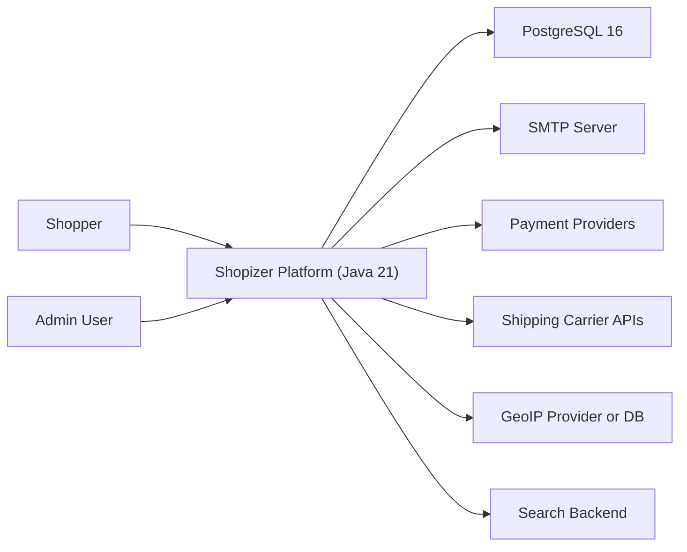
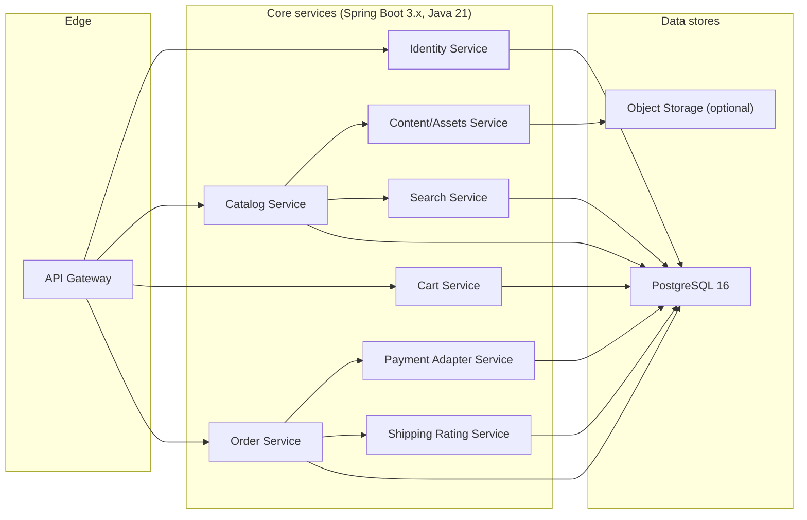
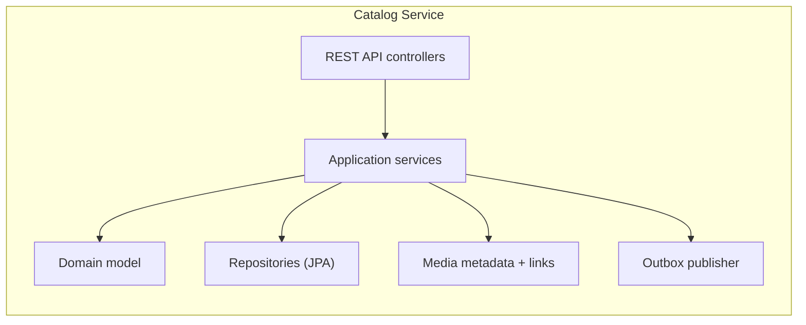
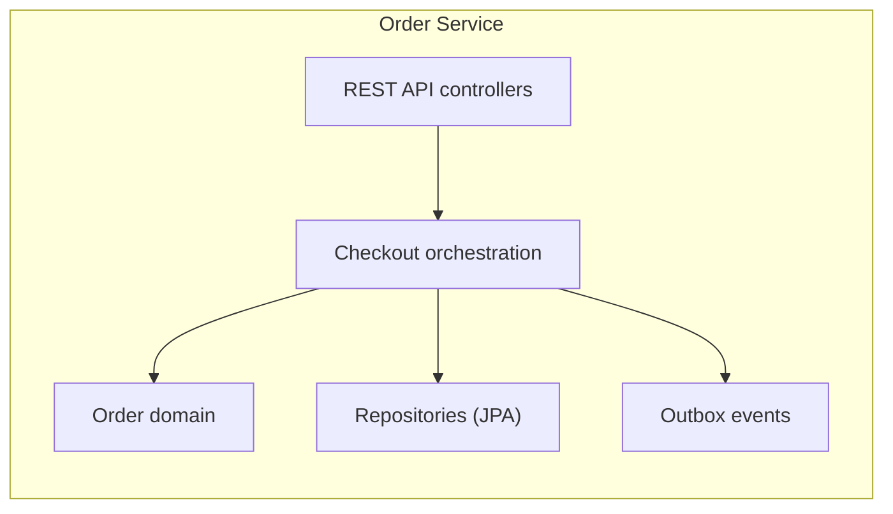
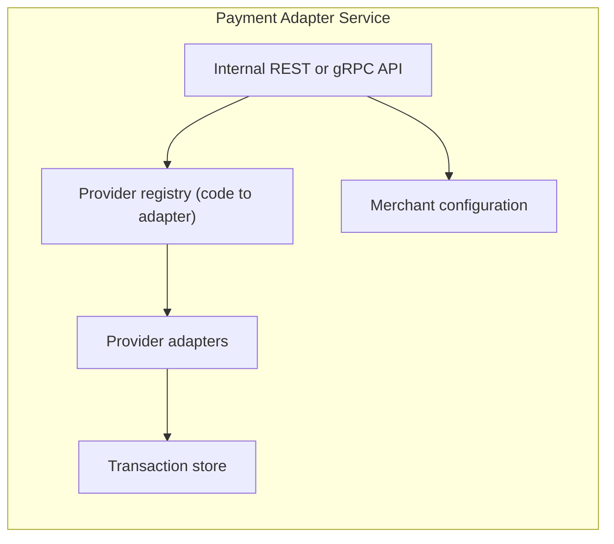
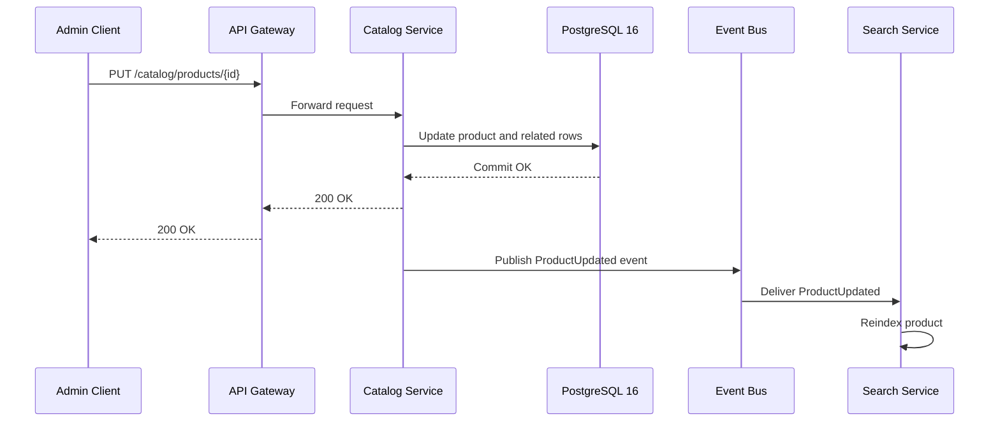
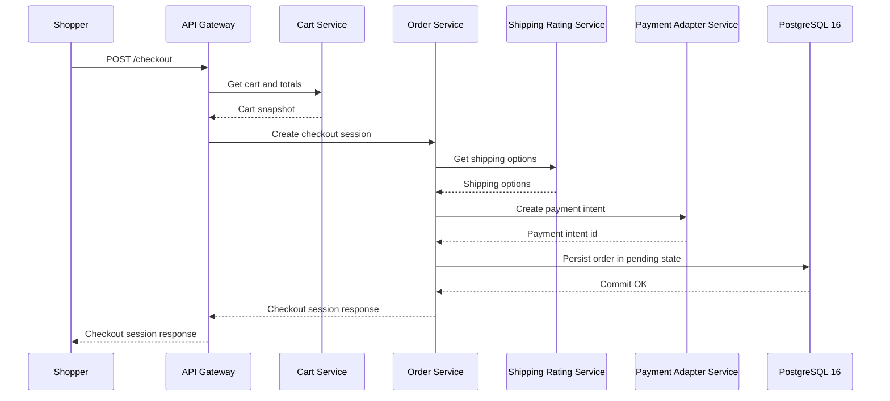
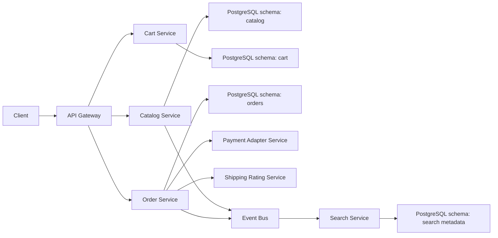
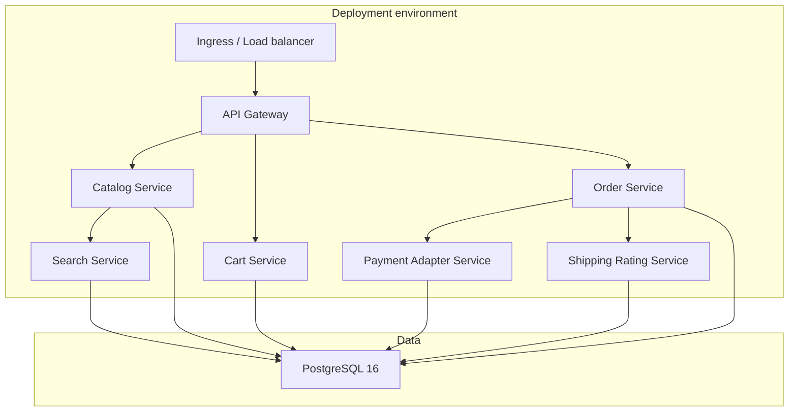

# Shopizer Java 21 Target Architecture (Spring Boot 3.x + PostgreSQL 16)

## 1. Purpose and scope

This document proposes a Java 21 target architecture for modernizing the legacy Shopizer 2.x monolith (located at `shopizer-329083/`) into a Spring Boot 3.x-based platform using PostgreSQL 16. It defines microservice boundaries, key runtime containers, integration patterns, and migration-friendly seams derived from the legacy architecture evidence.

This is a target-state architecture proposal. It is intentionally constrained to what is known from current sources. Where details are missing (for example, the exact legacy auth model or the exact Elasticsearch runtime topology), this document explicitly marks them as unknown.

## 2. Audience and assumptions

This document is written for engineers planning and implementing the modernization. It assumes familiarity with Java, Spring Boot, relational modeling, and service-to-service communication patterns.

The proposal assumes:

- Java 21 is the standard runtime.
- Spring Boot 3.x (Spring Framework 6) is the application framework.
- PostgreSQL 16 is the system of record for transactional commerce data.
- The modern repo may eventually host multiple deployable services, but the exact current build structure in `shopizer-modern-java21-329083/` is not evidenced from the sources used here.

## 3. System context

The modernized Shopizer platform serves the same primary actors as the legacy monolith: shoppers and admin users. It integrates with external payment providers, shipping carrier APIs, email infrastructure, and optional geo and search providers.

### 3.1 Context diagram (Mermaid)

This context view remains aligned with the legacy system boundary described in `docs/legacy-shopizer-2x/architecture-overview.md`, but the internal decomposition changes substantially.

## 4. Containers / runtime units

The target architecture is organized as a small set of independently deployable Spring Boot services. The service boundaries are derived from the legacy domain aggregates and service patterns, especially those visible in the persistence unit (`sm-persistence.xml`) and the web facade/service layering described in legacy docs.

### Proposed runtime containers

#### API Gateway (optional but recommended)

A single entrypoint for browser/mobile clients, providing routing, auth enforcement, rate limits, and response shaping. This can be implemented using Spring Cloud Gateway or an edge layer in Kubernetes ingress.

If the modernization is staged, the gateway can initially route to a “modular monolith” and later split out services behind stable APIs.

#### Identity and Access (optional)

Legacy Shopizer uses Spring Security in `sm-shop` (bootstrapped by `web.xml`), but the exact authorization model is not evidenced in the sources used here. A modern target should still isolate identity concerns because admin vs shopper roles are a cross-cutting requirement.

#### Catalog Service

Owns products, categories, manufacturers, product images metadata, and product read APIs. Derived from the catalog entities listed in `sm-persistence.xml` and the catalog orchestration patterns described in `docs/legacy-shopizer-2x/service-and-controller-reference.md`.

#### Cart Service

Owns shopping cart persistence and pricing calculation logic for carts. Derived from `ShoppingCart`, `ShoppingCartItem`, and `ShoppingCartAttributeItem` entities in `sm-persistence.xml`.

#### Order Service

Owns orders, order totals, status history, and order line lifecycle. Derived from order entities in `sm-persistence.xml`. Checkout orchestration can start here, but payment authorization should be delegated.

#### Payment Adapter Service

Implements the “module code -> implementation” registry pattern evidenced in `shopizer-core-modules.xml` and `integrationmodules.json`. It should expose a stable internal API for payment intents, captures, refunds, and status checks, while encapsulating provider specifics (PayPal express checkout, Beanstream, money order/offline).

#### Shipping Rating Service

Similarly implements shipping quoting behind a stable API. It should support UPS/USPS/Canada Post and custom weight-based rules as separate adapters, matching legacy module codes where feasible.

#### Content/Assets Service (optional)

Legacy Shopizer uses Infinispan-backed file managers for product images and static content with filesystem-backed cache stores (`shopizer-core-modules.xml`). In a modern architecture, the content service can abstract storage into object storage (S3-compatible) or Postgres-backed storage, depending on operational needs.

#### Search Service (optional)

Legacy code couples product lifecycle to search indexing (`SearchService` in `sm-core` and usage described in legacy docs). In the target architecture, indexing should be asynchronous and driven by domain events. The search service can own indexing and querying, using Elasticsearch/OpenSearch or PostgreSQL full-text search depending on requirements.

### 4.1 Container diagram (Mermaid)

This decomposition reflects the legacy “in-process” dependency graph, but converts it into explicit service calls and independent deployment units.

## 5. Components (per container)

This section outlines internal components for the highest-impact services, keeping terminology aligned with the legacy system where it provides a stable conceptual mapping.

### 5.1 Catalog Service (components)

The legacy codebase treats catalog as a large aggregate with many sub-entities and lifecycle logic. In the target design, this service should separate write-side commands from read-side queries and expose stable DTOs instead of JPA entities.

The “outbox publisher” is recommended to make indexing and integration side effects explicit and reliable.

### 5.2 Order Service (components)

Legacy order logic includes order totals and status history entities. The modern service should treat “checkout” as a workflow with idempotency, and it should integrate with payment/shipping via internal APIs.

### 5.3 Payment Adapter Service (components)

Legacy integrates payment modules by module code in `util:map` (`paymentModules`) and metadata in `integrationmodules.json`. This is a strong seam to preserve conceptually.

## 6. Low-level design (LLD)

This document does not attempt to fully specify code-level APIs and classes for the Java 21 implementation because the modern repo’s current service implementation is not part of the evidence set used here. Instead, it defines migration-safe contracts that align with the legacy system’s most important seams.

### 6.1 Migration-safe contracts to preserve

#### Integration module codes as stable identifiers

The legacy system uses codes like `ups`, `usps`, `paypal-express-checkout`, and `beanstream` as configuration keys and selection identifiers.

- Evidence: `shopizer-329083/sm-core/src/main/resources/spring/shopizer-core-modules.xml`, `shopizer-329083/sm-core/src/main/resources/reference/integrationmodules.json`.

Target contract: preserve these codes in configuration and APIs where they are externally visible (for example, in admin configuration endpoints and stored merchant configuration), even if internal implementation changes.

#### Domain events for indexing and side effects

Legacy product lifecycle triggers indexing side effects. In a microservice architecture, these side effects should become event-driven and asynchronous.

- Evidence: legacy docs describe indexing on product updates; search service exists (`SearchServiceImpl.java`).

Target contract: publish events such as `ProductCreated`, `ProductUpdated`, `ProductDeleted`, and consume them in the search service and any downstream projection builders.

## 7. Key flows (sequence diagrams)

### 7.1 Create or update product with asynchronous search indexing

This sequence is the modernization equivalent of the legacy “product update triggers indexing” behavior, but it removes tight coupling between the write path and the search backend availability.

### 7.2 Checkout with payment authorization and shipping rate selection

The payment/ship services implement the legacy module patterns but make them explicit and testable.

## 8. Data flow and storage

### PostgreSQL 16 as system of record

The legacy data model is extensive and was originally designed around JPA/Hibernate with MySQL/H2 compatibility. In the target state, PostgreSQL 16 is the system of record for transactional entities.

A practical storage approach is:

- Each microservice owns its schema (separate Postgres schemas or separate databases), with Flyway migrations managed per service.
- Cross-service joins are avoided; instead, services exchange identifiers and use replication/projection patterns where needed.

### 8.1 Dataflow diagram (Mermaid)

## 9. Deployment / execution topology

This section describes a typical deployment topology, independent of whether the repo currently uses Kubernetes, Docker Compose, or another orchestrator. No concrete deployment manifests for the modern repo were evidenced in the sources used for this document.

### 9.1 Deployment diagram (Mermaid)

## 10. Interfaces and integration points

### Inbound interfaces

The legacy system exposes:

- Storefront/admin MVC endpoints
- REST-like endpoints under `/services/**`

- Evidence: `docs/legacy-shopizer-2x/architecture-overview.md`, `shopizer-329083/sm-shop/src/main/webapp/WEB-INF/web.xml`.

Target recommendation:

- Expose REST APIs with clear versioning and DTO contracts.
- Optionally maintain a compatibility layer or BFF if legacy clients must be supported.

### Outbound integrations

The legacy integration inventory includes:

- Payment: PayPal Express Checkout, Beanstream, money order (offline).
- Shipping: UPS, USPS, Canada Post, custom weight-based.
- Email: SMTP via JavaMailSender.
- GeoIP2: MaxMind library usage.
- Search: Elasticsearch-era integration (details not fully evidenced).

- Evidence: `shopizer-core-modules.xml`, `integrationmodules.json`, and `docs/legacy-shopizer-2x/external-integrations.md`.

Target recommendation:

- Encapsulate each external provider in a dedicated adapter (in a service or module) so credentials, retries, and API evolution are isolated.
- Make outbound calls observable (structured logs + metrics + traces), and use circuit breakers for carrier/gateway APIs.

## 11. Cross-cutting concerns (NFRs)

### Reliability

The legacy system runs everything in-process. The target introduces network boundaries, so failure handling must be explicit. Payment and shipping calls should be retried carefully (idempotency keys, provider-specific semantics). Checkout should be resumable.

### Observability

Introduce consistent structured logging, metrics, and tracing across services. This is especially important for payment/shipping workflows and search indexing.

### Security

The legacy system uses Spring Security via the servlet filter chain, but details were not part of the evidence set read for this task. The target should implement:

- Modern Spring Security configuration.
- Token-based auth (OAuth2/OIDC) or session-based auth depending on UI.
- Secrets management for payment/shipping credentials.

### Compatibility

Avoid attempting to preserve Java 6 era libraries and XML wiring in the new codebase. The legacy `web.xml` and Spring 3.1-era XML contexts are intentionally replaced with Spring Boot conventions.

## 12. Design decisions and tradeoffs

A staged approach is recommended: start with a “modular monolith” in Spring Boot 3.x using well-defined module boundaries (catalog, cart, orders, integrations), then split services when operational readiness and test coverage support it. This reduces early distributed-systems complexity while still preventing re-entangling the codebase.

Preserving integration module codes (for example `ups`, `paypal-express-checkout`) is recommended because they are evidenced as stable configuration keys in the legacy system and can reduce migration friction for merchant configuration.

## 13. Risks, gaps, and follow-ups

The most important evidence gaps that should be resolved early are:

- The exact legacy authentication and authorization rules, including admin vs shopper role models, because this impacts endpoint protection and UI integration. The relevant legacy file is likely `sm-shop/src/main/webapp/WEB-INF/spring/appServlet/shopizer-security.xml`, but it was not part of the evidence set read for this task.
- The exact legacy search infrastructure and index schemas. The legacy repository contains `SearchServiceImpl` and controllers, but operational configuration details were not evidenced.
- The current state of the modern repo build/deploy setup (whether it is single-service or multi-service today). No `pom.xml`, Gradle files, or deployment manifests were located via the searches performed during this task.

Task completed in this document: a proposed Spring Boot 3.x + PostgreSQL 16 microservice target architecture with Mermaid context/container/component/dataflow/deployment diagrams and migration-aligned contracts derived from legacy evidence.
